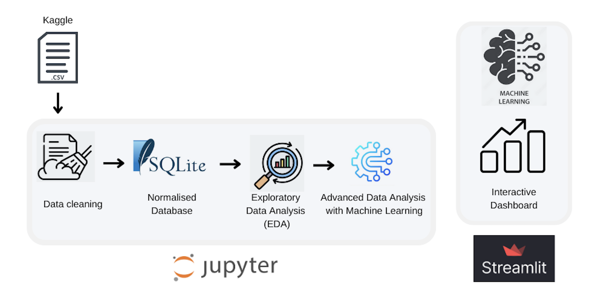

# Heart Attack Analysis and Prediction

This project focuses on the **analysis and prediction of heart attack outcomes** using machine learning models, data visualization, and statistical techniques. The study leverages patient-level clinical and demographic data to identify key factors contributing to heart attack risks and provides an interactive dashboard for exploratory analysis and predictions.

## Project Overview
- **Dataset Source**: Kaggle - Heart Attack Analysis and Prediction
- **Database Used**: SQLite
- **Technologies**: Python, Streamlit, Scikit-learn, Pandas

## Architecture

## Key Features
### 1. Dataset Collection and Cleaning
- Addressed missing values using imputation.
- Detected and handled outliers with Interquartile Range (IQR) and Winsorization.
- Performed feature engineering, including adding an `age_group` variable for better analysis.

### 2. Relational Database Design
- Utilized SQLite to store and manage the dataset.
- Normalized tables to 1NF, 2NF, and 3NF:
  - **Patients**: General information (e.g., ID, age, sex, age group).
  - **Medical Data**: Key clinical indicators (e.g., cholesterol, blood pressure).
  - **Results**: Heart attack outcome and derived insights.

### 3. Exploratory Data Analysis (EDA)
- Conducted univariate, bivariate, and multivariate analysis.
- Key insights:
  - **Age** and **cholesterol** are critical risk factors.
  - **ST depression (oldpeak)** and **maximum heart rate (thalachh)** show strong correlations with heart disease outcomes.
- Visualized data using histograms, scatter plots, and heatmaps.

### 4. Machine Learning Models
Evaluated multiple models for predicting heart attack outcomes:
- **Best Model**: K-Nearest Neighbors (KNN) with 93.67% accuracy.

### 5. Interactive Dashboard
Built using **Streamlit** to serve two main purposes:
1. **EDA**: Interactive visualizations such as histograms, scatter plots, and heatmaps.
2. **Prediction**: User-provided clinical inputs (e.g., age, cholesterol levels) are used to predict heart attack likelihood via the trained KNN model.

## Key Insights
- Older individuals and those with high cholesterol or low maximum heart rates are at greater risk of heart attacks.
- Regular screening and monitoring of key factors can help identify high-risk individuals and prevent cardiovascular issues.
- KNN emerged as the most effective model for prediction, followed by Decision Tree for interpretability.

## References
- [SQLite Documentation](https://www.sqlite.org/docs.html)
- [Pandas Missing Data Handling](https://pandas.pydata.org/docs/user_guide/missing_data.html)
- [Scikit-learn](https://scikit-learn.org/stable/index.html)
- [Streamlit](https://docs.streamlit.io/)

